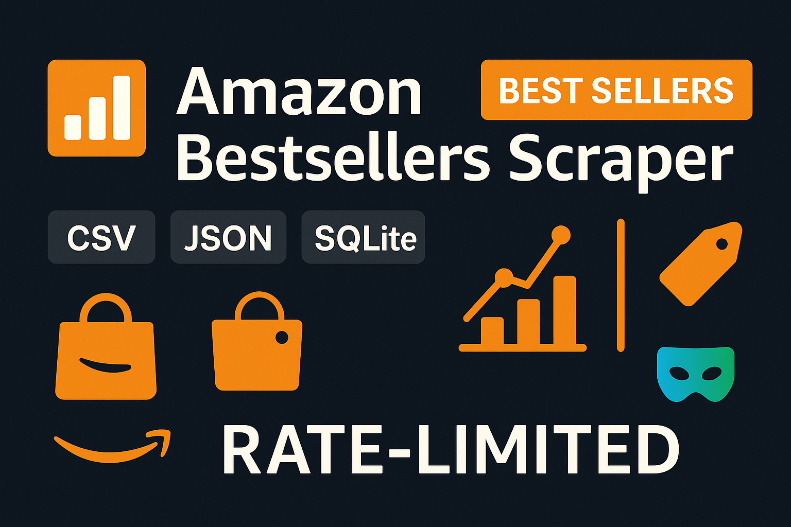

#  Amazon Bestsellers Scraper – Analytics Tool

<p align="center"> <a href="https://github.com/yourusername/facebook-bot">  </a> </p>

<p align="center">
  <a href="https://discord.gg/vBu9huKBvy">
    
  </a>
  <a href="https://t.me/devpilot1">
    
  </a>
</p>

---

##  Overview

**Amazon Bestsellers Scraper** is a Python-based tool to efficiently scrape top-selling products on Amazon.  
It collects structured data including product titles, prices, ratings, and URLs, making it perfect for e-commerce analysis, affiliate research, or market insights.

### Key Benefits:
- Extract **real-time product data** from Amazon Bestsellers  
- Automate **multi-category scraping**  
- Export results in **CSV, JSON, or Excel**  
- Mimic human browsing to reduce **IP blocks**  
- Customizable scraping with **CLI or config file**  

---

##  Core Features

| **Feature**                        | **Description**                                                                                  |
|------------------------------------|--------------------------------------------------------------------------------------------------|
| **Scrape Product Data**             | Extract product name, price, rating, and product link from Amazon Bestsellers pages.            |
| **Category Support**                | Scrape multiple categories like Electronics, Books, Toys, and more.                              |
| **Pagination Handling**             | Automatically scrape multiple pages per category.                                               |
| **Export Data**                     | Save scraped data as CSV, JSON, or Excel for analysis.                                           |
| **Proxy & IP Rotation**             | Optional proxy support to prevent IP bans.                                                      |
| **Delay & Throttle Requests**       | Randomized delays and throttling to mimic human browsing.                                       |
| **CLI & Configurable Options**      | Choose categories, number of pages, and output format via config file or CLI arguments.         |
| **Logging**                         | Track successful scrapes, errors, and skipped products.                                         |

---

<p align="center">
  
</p>

##  Target Audience

- E-commerce marketers & affiliates  
- Amazon sellers and competitors  
- Data analysts and researchers  
- Python developers learning web scraping  

---


##  Contact

- 💬 [Join Discord Community](https://discord.gg/vBu9huKBvy)  
- 📱 [Contact via Telegram](https://t.me/devpilot1)  

---

##  Installation Instructions

### 1. Clone the Repository
```bash
python -m venv .venv && source .venv/bin/activate  # Windows: .venv\Scripts\activate
pip install -r requirements.txt

# Convert example CSV → JSON
python src/cli.py --csv data/examples.csv --out data/examples.json

# Start local practice server
uvicorn src.practice_api:app --reload --port 8000

# Open web UI
# Serve the web/ folder (e.g., with VS Code Live Server) or a quick Python server:
# In another terminal:
#   cd web && python -m http.server 5500
# Then open http://localhost:5500 and upload data/examples.json

